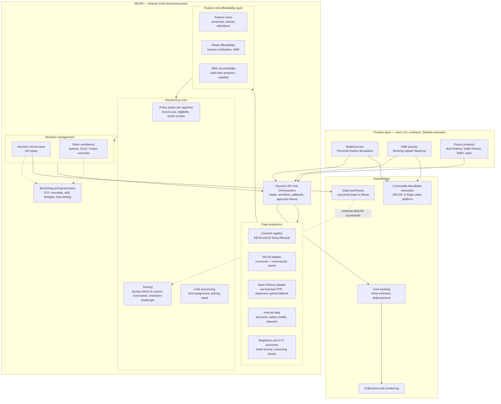

# ⚖️ Mizan — Shared Credit Decisioning Layer · PRD & Execution Roadmap

> **Mizan** (ميزان — "the scales") is the working codename for Mal Bank's product-agnostic credit decisioning service: one platform that any lending product — retail or SME — calls to get an eligibility decision, a facility limit, and pricing guidance.

| Field | Value |
|---|---|
| Document owner | Evgeny Muravev |
| Status | **Draft v1.0 — for panel review** |
| Product stage | 0 → 1 (internal platform product) |
| Date | July 2026 |
| Anchor journeys | Retail personal finance (Murabaha/Tawarruq) · SME working capital (revolving Tawarruq) |
| Consumers of this service | Retail lending squad, SME lending squad, future product teams (auto finance, trade finance) |
| Key stakeholders | CRO / Credit Risk, ISSC & Shari'ah Compliance, Compliance & Consumer Protection, Data/Analytics, Core Banking, Operations (credit review) |

**How to read this in 20 minutes:** §1 Executive Summary → §5 Functional Architecture → §7 Trade-offs → §9 Roadmap. Everything else (§8 Requirements, §10 Backlog, §11 Integrations) is the supporting depth.

---

## 1. Executive Summary

Mal Bank runs two lending portfolios on largely bespoke scoring and underwriting logic. As both scale, every new product re-implements the same plumbing — bureau consent, AECB pulls, affordability computation, decision audit — while the genuinely different parts (retail vs SME underwriting judgment) get entangled with that plumbing and become slow to change.

**Mizan** is a shared decisioning layer with a simple contract: a product journey submits an application; Mizan orchestrates consent, data acquisition (AECB + open-finance/bank data + internal data), affordability, policy rules, and scoring; and returns **approve / refer / decline + facility limit + risk grade + pricing band**, with every decision fully replayable for audit — CBUAE model-risk audit *and* Shari'ah audit.

**The six positions this document takes** (argued in §7):

1. **Share the pipes, not the brain.** One decisioning platform and one data layer; segment-specific policy packs and scorecards for retail vs SME. No single unified scoring model.
2. **Buy the decision engine, own the contract.** License a configurable decisioning platform (deployed in-UAE per the Outsourcing Regulation); build the decision API, adapters, feature definitions, and decision record store in-house so the vendor stays swappable.
3. **Real-time bureau, cached and reusable.** Real-time AECB API pulls at application with a consent-bound cache; monthly furnishing is a separate compliance pipeline.
4. **Shariah-aware, not Shariah-executing.** Mizan issues a time-boxed approval; Murabaha/Tawarruq contract execution (wakala → commodity purchase → offer/acceptance) stays in the product layer. Mizan's decision log links to contract events so the full sequence is auditable.
5. **Consent is a first-class shared service.** A central consent registry (AECB + Al Tareq open finance) is the prerequisite for the highest-value future capability: continuous re-scoring and limit management.
6. **Refer is a designed path, not a failure mode.** SME lending will launch refer-heavy by design; the workbench, SLAs and override governance are core scope, not afterthoughts.

**Why now:** the UAE data infrastructure has just crossed the threshold that makes this layer worth building. Open Finance went live under Al Tareq in January 2026 (FAB, CBD, ADIB), AECB's Credit Score 3.0 launches in 2026 with alternative-data scores for thin files, e-invoicing becomes mandatory from 2027, and the new SME Customer Protection Regulation (Circular 2/2026) raises the conduct bar on SME lending. A bank that wires these into one decisioning layer now will originate faster and safer than one that retrofits later.

**Strategic frame.** Mizan is not a neutral utility — it is the engine that operationalizes Mal's credit portfolio strategy (companion document: [Cross-Border Underwriting Dossier](strategy-dossier.html)). Three strategy commitments shape the platform's design beyond the anchor journeys: **(a) cross-border data is the differentiated asset** — domestic aggregation commoditizes as Al Tareq phases in, so the adapters that matter most are the ones that see the *other* country of an expat's life (home-country bureau via the AECB × Nova Credit Passport rail, home-country accounts, remittance behavior); **(b) intent is underwriting material** — the agentic PFM platform generates goal-pursuit telemetry (a shadow instalment history and the earliest distress sensor there is), which Mizan ingests as a governed, overlay-only feature stream; **(c) risk is managed at day zero and recourse is structured at origination** — early-warning signals fire same-day, and approvals carry machine-readable, consent-based recourse conditions (salary/EOSB assignment, takaful, remittance-linked repayment) rather than improvised collections pressure later.

---

## 2. Context, Problem, Goals

### Context

Mal Bank operates retail consumer finance (personal finance/Murabaha, salary advance/Qard Hassan, auto finance) and SME lending (working capital, term, trade finance) as parallel stacks. Each product today embeds its own scoring calls, policy logic and manual review flow. This made sense at launch; at scale it produces three compounding costs: duplicated integration spend, inconsistent risk treatment of the same customer across products, and — most damaging — a credit policy iteration cycle gated on engineering releases.

Meanwhile the market context is moving: digital-native competitors (Wio in SME, ruya in Islamic retail finance) are originating with instant or near-instant decisions; ruya already executes commodity Murabaha straight-through via DDCAP's ETHOS platform. Regulatory infrastructure (Al Tareq, AECB 3.0, e-invoicing) is turning data that used to be documents into APIs.

The portfolio strategy this layer serves is set out in the companion dossier: the UAE's ~60 licensed banks all underwrite the onshore half of a predominantly expatriate customer base, pricing the "skip" blind as a margin tax. Mal's edge is consented cross-border visibility — income, obligations, credit history and *intentions* in both countries of the borrower's life — and a product sequence ordered by learning speed (fast-seasoning, granular, Shari'ah-native products first; mortgage refinance last, as retention). Mizan is where that strategy becomes executable: the cross-border adapters, the intent-feature governance, the day-zero early-warning loop and origination-time recourse conditions all live in this layer.

### Problem

> **Every new lending decision at Mal Bank re-builds the same underwriting plumbing — slowly, inconsistently, and in a way Credit Risk cannot tune without an engineering release.**

### Goals

1. **One decision API** any lending product calls — retail personal finance and SME working capital live on it within the roadmap horizon; a third product onboards in weeks, not months.
2. **Credit Risk self-service**: policy parameters, cut-offs and challenger strategies changed by the risk team in days, under governance, without code deployment.
3. **Automation with control**: ≥80% straight-through processing (STP) on retail personal finance by month 9; SME working capital launched refer-first, reaching ≥40% STP by month 12.
4. **Every decision replayable**: 100% of decisions reconstructable — inputs, features, rules fired, model version, human overrides — satisfying CBUAE Model Management Standards, the 2026 AI/ML guidance note, and internal/external Shari'ah audit.

### Non-goals (explicitly out of scope)

- Origination UX, KYC/onboarding, and contract execution (Murabaha/Tawarruq mechanics) — Mizan integrates with these, it does not own them.
- Fraud decisioning and AML screening — separate services; Mizan consumes their outcomes as inputs.
- Collections strategy and recovery scoring — adjacent roadmap, not in this document (interface points noted).
- Deposit/investment product decisioning.

### Definition of Done (for this roadmap)

Both anchor journeys decision through Mizan in production; Credit Risk has shipped ≥3 policy changes without engineering; a third product's decisioning has been onboarded using only configuration and adapters — no changes to the core.

### Value proposition

**Customers (retail & SME):** decisions in minutes not days; one consent experience; consistent treatment across products; transparent decline reasons (AECB 3.0-aligned reason codes, Arabic + English).

**Mal Bank:** faster product launches on shared rails; lower cost per decision; a single governed control point for CBUAE model-risk, consumer-protection and Shari'ah obligations; portfolio-level risk visibility across segments.

**Credit Risk team:** ownership of policy without engineering dependency; champion/challenger experimentation; one decision dataset to build future scorecards on.

---

## 3. Glossary

| Term | Definition |
|---|---|
| **Murabaha** | Cost-plus **sale** (not a loan): the bank acquires an asset and sells it to the customer at disclosed cost + profit, paid deferred. Governed by AAOIFI Shari'ah Standard 8; codified in UAE Commercial Transactions Law (Arts. 468–497). |
| **Tawarruq / commodity Murabaha** | Monetization structure behind "cash" finance: bank buys a commodity, sells it to the customer on deferred Murabaha terms, customer (usually via agency) sells it for spot cash. Governed by AAOIFI SS 30. |
| **Qard Hassan** | Benevolent interest-free loan (basis of salary advance). Only a flat admin fee equal to actual service cost is permitted — the fee may not scale with amount or tenor (AAOIFI SS 19). |
| **Wakala** | Agency contract; in Tawarruq, the customer typically appoints the bank as agent to sell the commodity. Must be a contract separate from the Murabaha. |
| **AECB** | Al Etihad Credit Bureau — UAE federal credit bureau. Consumer & commercial reports and scores (300–900). Consent-based access under Federal Law 6/2010; mandatory pull before granting credit; mandatory monthly furnishing. |
| **Al Tareq / Nebras** | UAE Open Finance framework: Nebras Open Finance LLC (CBUAE / Al Etihad Payments subsidiary) operates the central API hub and trust framework; "Al Tareq" is the consumer-facing consent brand. Regulation: Circular 3/2025 (replacing 7/2023). |
| **OFP / TPP** | Open Finance Provider — the CBUAE license category for third parties consuming open-finance data / initiating services. A bank may itself obtain OFP authorization (ADIB, April 2026). |
| **DBR** | Debt Burden Ratio — total monthly repayment obligations ÷ gross salary + regular income. Regulatory cap 50% (30% for retirees). |
| **STP** | Straight-through processing — decisions completed with no human touch. |
| **Refer** | Decision outcome routing an application to a human credit analyst with a structured worklist and SLA. |
| **HSA / ISSC** | Higher Shari'ah Authority (CBUAE, rulings binding on all Islamic financial institutions) / Internal Shari'ah Supervision Committee (Mal Bank's own board-level Shari'ah committee; its fatwas bind the bank). AAOIFI standards are mandatory minimums in the UAE since 1 Sept 2018. |
| **MMS** | CBUAE Model Management Standards (Dec 2022) — mandatory lifecycle governance for all models, including credit scoring: Model Oversight Committee, independent validation, prescribed monitoring. |
| **KFS** | Key Facts Statement — mandatory plain-language product disclosure (Arabic + English) under the Consumer Protection Standards. |
| **ESR** | AECB's Expense-to-Salary Ratio indicator — bureau-computed obligations vs reported salary, included in credit reports since 2022. |

---

## 4. Guiding Principles

1. **Product-agnostic core, product-specific configuration.** A new product = a *product manifest* (data requirements, policy pack, scorecard binding, limit logic) — never a change to the core engine.
2. **Decisions are data.** The decision record — not the loan account — is the atomic asset: versioned inputs, features, rules, models, outcomes. It feeds audit, scorecard development, and regulatory reporting.
3. **Regulatory rules are code-reviewed policy primitives.** DBR ≤ 50%, 20× salary cap, 48-month tenor, mandatory AECB check, sector exclusions — encoded once, centrally, tested, and reused by every policy pack. Products cannot opt out.
4. **Human judgment is part of the system.** Overrides are structured (reason-coded, 4-eyes, monitored), and override analytics feed policy iteration.
5. **Degrade gracefully.** Every external dependency (AECB, Al Tareq, registries) has a defined fallback: cached data, document upload, or refer — never a hard journey failure.
6. **Bilingual and explainable by design.** Every decline/refer carries customer-safe reason codes renderable in Arabic and English — a 2026 AI/ML guidance-note requirement, and the right thing to do.

---

## 5. Functional Architecture

### 5.1 The picture

### 5.2 What is shared vs segment-specific

| Capability | Shared | Retail-specific | SME-specific |
|---|---|---|---|
| Decision API contract, orchestration, approval tokens | ✅ | — | — |
| Consent registry (AECB + open finance) | ✅ | — | — |
| AECB adapter | ✅ | Consumer report + score, ESR, Credit Passport for thin files | Commercial report + score **plus** personal reports of shareholders/guarantors (blended view) |
| Open finance / bank data ingestion | ✅ | Salary account transactions | Business account cash-flow, multi-bank |
| Feature store & categorization | ✅ engine | Salary detection, obligations | Inflow stability, concentration, seasonality, bounced-cheque signals |
| Affordability | ✅ framework | DBR ≤ 50% (30% retiree), 20× salary, 48-month tenor | Serviceability from verified net cash-flow; owner obligations counted |
| Policy packs | ✅ engine + regulatory primitives | Retail pack (age, residency, salary floor, employer risk) | SME pack (license validity/age, sector screen incl. Shari'ah exclusions, entity age, cheque history) |
| Scorecards | ✅ hosting, registry, champion/challenger | Retail application scorecard (bureau-anchored v0) | SME scorecard (owner score + commercial score + cash-flow features) |
| Limit & pricing | ✅ framework | Limit = min(DBR headroom, 20× salary, product cap); pricing band | Limit = f(verified monthly net inflows, tenor); facility + drawdown structure |
| Refer workbench, decision store, monitoring | ✅ | Queue config | Queue config, RM attachments |
| Cross-border data adapters | ✅ engine | Credit Passport (home bureau via AECB × Nova), home-country accounts/statements, remittance behavior | Cross-border supplier/buyer flows, trade counterparty data |
| Goal-pursuit / intent telemetry (from PFM agent) | ✅ ingestion + governance | Goal-contribution consistency, goal–behavior delta, distress signal (contributions stop) | Plan-vs-actual variance, use-of-proceeds tracking, milestone hit-rate |
| Recourse-conditions engine | ✅ framework | Salary + EOSB assignment, takaful, remittance-linked repayment | Kafalah/guarantor structuring, personal guarantees |

**The sharing prize is the left column — roughly 70% of build effort — not a unified model.** Retail and SME underwriting genuinely differ; forcing one scoring engine across both would be worse at each and slower to iterate.

### 5.3 Anchor journey 1 — Retail personal finance (Murabaha/Tawarruq)

1. Customer applies in-app; product layer captures amount/tenor and **consent** (AECB pull consent per Federal Law 6/2010 + open-finance consent where used) → registered in the consent registry.
2. Mizan orchestration validates KYC/screening outcomes (consumed, not performed), pulls **AECB consumer report + score** in real time (cache TTL applied), acquires salary/transaction data (internal salary-transfer history where Mal Bank is the salary bank; Al Tareq via TPP otherwise; ESR as cross-check).
3. Feature layer verifies income, computes obligations (including guarantees) and **DBR**. Thin-file applicants route to the **cross-border path, not an exception queue**: with consent, the Credit Passport pull (home-country bureau via AECB × Nova Credit) converts a no-hit into an underwritable file — per the strategy dossier, this population is a target approval segment (Amex's Credit Passport-approved newcomers ran 79% less risky than domestic prime), approved conservatively with recourse conditions rather than referred by default.
4. Retail policy pack runs knock-outs (regulatory primitives + bank policy); scorecard assigns risk grade; limit engine computes max facility = min(DBR headroom at proposed tenor, 20× salary, product cap); pricing band selected by grade (banded, not individual — see §7.5).
5. Mizan returns **approve + limit + pricing band + approval token** (validity window, conditions) in < 5 minutes p90, or refer/decline with reason codes. The token's conditions include **origination-time recourse**: salary-transfer + EOSB assignment, credit-shield takaful enrollment, and — for cross-border-underwritten approvals — a remittance-linked repayment schedule (instalment settles before the home transfer leaves). Consent-based recourse structured here is what makes day-zero risk management possible later; it is never improvised at delinquency.
6. **Product layer executes the Shari'ah leg**: customer promise, wakala, commodity purchase and Murabaha offer/acceptance via an execution platform (DDCAP/Eiger-class), then disbursement. *The debt legally exists only after this sequence — Mizan's approval is a risk decision, not a contract.* Contract event IDs are written back to the decision record so Shari'ah audit can replay approval → execution ordering end-to-end.
7. Cooling-off (5 business days, waivable in writing) and KFS disclosure are product-layer obligations; Mizan supplies the numbers (profit rate band, total obligation) that populate the KFS.

**Salary advance (Qard Hassan) corollary:** because AAOIFI SS 19 forbids fees that scale with amount or tenor, there is no pricing lever — decisioning for salary advance is pure eligibility + limit control (% of verified salary, e.g. market practice 80–90% capped). It should be Mizan's simplest policy pack, and it is a cheap early proof of product-agnosticism.

### 5.4 Anchor journey 2 — SME working capital (revolving Tawarruq)

1. SME applies via business portal or RM; consents captured for **entity and individual** pulls (owners/guarantors).
2. Data acquisition: AECB **commercial** report/score + **personal** reports of major shareholders and guarantors; trade license validity (registry lookup); business banking data — Mal Bank accounts internally, other banks via Al Tareq TPP where live, otherwise **statement upload with automated parsing** (the designed fallback, not an exception); optionally VAT returns as documents at higher ticket sizes.
3. Feature layer computes cash-flow serviceability: verified monthly net inflows, inflow stability and concentration, bounced-cheque history (bureau + ChequeScore-class signals), owner obligations.
4. SME policy pack: regulatory + Shari'ah **sector screen** (ISSC-approved exclusion list seeded from the AAOIFI SS 21 taxonomy: conventional finance, alcohol, gambling, pork, adult entertainment, weapons; tobacco per ISSC ruling), license age/validity, minimum trading history, purpose-of-finance undertaking.
5. Facility-level decision: **approve / refer / decline + facility limit** (e.g., a multiple of verified monthly net inflows, tenor-adjusted) + pricing band. At launch most non-trivial cases **refer by design** to the workbench with a pre-assembled credit file (all data, features and rule results on one screen — the analyst's time goes to judgment, not data gathering). Target: refer resolution < 24h.
6. **Drawdowns**: each revolving drawdown is a fresh commodity-Murabaha cycle executed by the product layer; Mizan performs a lightweight **drawdown check** (limit availability, arrears status, material-deterioration flag) rather than full re-underwriting — this keeps utilization instant while the Shari'ah execution runs straight-through.
7. Ongoing: facility review triggers (behavioral, time-based) route through the same API — the re-scoring foundation (§8.10).

---

## 6. Regulatory & Shari'ah Guardrails (what the engine must encode)

These are hard constraints, encoded once as shared policy primitives (§4.3). Sources were verified against CBUAE Rulebook material and current legal commentary; items to re-verify against primary texts during discovery are flagged in §15.

### 6.1 Regulatory primitives

| Rule | Source | Encoding in Mizan |
|---|---|---|
| AECB report must be requested before extending credit; borrower data furnished at least monthly | CBUAE Rulebook credit-report articles; Federal Law 6/2010 | Bureau pull is a mandatory orchestration step; furnishing pipeline is a P1 epic |
| Written customer consent to access credit information | Federal Law 6/2010 (as amended) | Consent registry gate — no consent record, no pull, no decision |
| DBR ≤ 50% of gross salary + regular income; ≤ 30% for retirees | Reg 29/2011 / CPS | Shared affordability primitive; retiree flag switches cap |
| Personal finance ≤ 20× salary; tenor ≤ 48 months | Reg 29/2011 | Retail limit-engine ceiling |
| Auto finance ≤ 80% LTV, ≤ 60 months (future product) | Reg 29/2011 | Pre-built primitive for P4 onboarding |
| Responsible financing: affordability beyond mechanical DBR; suitability | CPS Art. 7 | Income verification standards; refer triggers on affordability edge cases |
| 5-business-day cooling-off (waivable in writing); KFS in Arabic + English | CPR 8/2020 / CPS | Product-layer duty; Mizan supplies KFS figures and records decision basis |
| Fee caps incl. early settlement ≤ 1% or AED 10,000 | Reg 29/2011 Appendix 2 (as amended 2019) | Pricing engine validation bounds |
| SME conduct: segmentation, no bundling/tied selling, disclosure and complaint SLAs | SME Customer Protection Regulation, Circular 2/2026 (effective ~H2 2026) | SME policy pack + decision comms templates; launch-blocking compliance review in P2 |
| Model governance: Model Oversight Committee, independent validation, monitoring, full documentation | Model Management Standards (Notice 5052/2022) | Model registry, validation workflow, monitoring dashboards are core scope — not compliance retrofits |
| AI/ML: explainability for credit decisions, fairness/bias stress-testing, human oversight, bank fully responsible even when outsourced | CBUAE Guidance Note, 11 Feb 2026 | Reason codes on every decision; scheduled bias tests; vendor due-diligence pack |
| Material outsourcing needs prior CBUAE non-objection; confidential customer data stays in-UAE absent CBUAE + customer consent | Outsourcing Regulation & Standards (2021) | **Vendor must deploy in-UAE**; non-objection filing is a P0 roadmap gate |
| Purpose limitation on personal data: service data may not be repurposed beyond its consented use | PDPL (Federal Decree-Law 45/2021); CPS data-protection provisions | PFM/goal telemetry enters credit features only under an explicit, separately consented purpose; it is **never** available to collections as pressure material (no debt disclosure to family, no contact-graph leverage — the dossier's "never" list is encoded as a platform-level access restriction, not a policy hope) |

### 6.2 Shari'ah constraints with direct decisioning impact

| Constraint | Source | Product implication |
|---|---|---|
| Murabaha sequence is validity-critical: promise → bank acquires asset → offer/acceptance. Approval ≠ debt. | AAOIFI SS 8, SS 30 | Mizan issues a time-boxed **approval token**; contract events logged against the decision record; sequencing provable in Shari'ah audit |
| Sale price immutable once contracted; no increase for late payment or extension; rescheduling only without debt increase | AAOIFI SS 8; UAE courts | Re-pricing levers excluded from collections-adjacent logic; restructuring flows cannot touch price |
| Late payment amounts are **charity donations**, not income; late-payment interest void even if agreed (Dubai Cassation 595/2025; Cassation 9/2025 voided "interest"-labelled clauses) | AAOIFI SS 3; UAE case law | Terminology is revenue protection, not cosmetics: "profit rate" not interest, "finance" not loan — enforced in reason codes, KFS feeds, all decision comms |
| Qard Hassan fee = actual service cost only; cannot scale with amount or tenor | AAOIFI SS 19 | No risk- or amount-based fee tiers on salary advance; eligibility/limit control only |
| No sale of debt at discount | AAOIFI SS 59 | No discounted NPL sales for capital relief; collections outsourcing fee-based — affects portfolio strategy assumptions, not the engine |
| Sector screening for SME financing; financed goods must be halal | AAOIFI SS 21 taxonomy + ISSC policy | Machine-readable, ISSC-approved exclusion list versioned in the policy engine; purpose-of-finance undertakings captured |
| ISSC approval scope covers policies, product structures, contracts and operational process flows; AAOIFI standards binding minimums (HSA Res. 18/3/2018) | CBUAE Shari'ah Governance Standard | New engine, sector screens, pricing/fee mechanics, late-payment handling all need ISSC sign-off. **Recommendation: agree a materiality-based delegation matrix with the ISSC up front** — e.g., score cut-off recalibration within an approved framework = internal; anything touching contract mechanics, fees or exclusions = ISSC. Without this, the "policy changes in days" goal dies in committee. |
| Risk-based pricing: no explicit prohibition found; price must be fixed and disclosed at contract execution; ISSC holds a "fairness" remit; large UAE Islamic banks practice category-uniform rates | Doctrine + market practice | **Launch with banded pricing** (grade → band); revisit individual risk-based markup with ISSC in P3. Engine outputs a band either way, so the decision is reversible. |

---

## 7. Key Trade-offs & Recommendations

### 7.1 One unified scoring engine vs segment-specific engines sharing data plumbing

**Recommendation: one decisioning *platform*, two decisioning *brains* (policy packs + scorecards per segment).** A unified model flattens genuinely different risk logic: retail is salary-anchored, high-volume, thin application data; SME is cash-flow-anchored, heterogeneous, blends entity and owner risk. But separate *platforms* would duplicate the 70% of effort that is identical (consent, bureau, data, audit, workbench, monitoring). Share infrastructure and feature definitions; never force one model. This also mirrors how the org works — one Credit Risk function, different credit committees/appetites per segment.

### 7.2 Build vs buy the rules/decisioning engine

**Recommendation: buy the engine; build the boundary.** License a configurable decisioning platform for rules authoring, champion/challenger and simulation — this is exactly the capability that gives Credit Risk self-service, and building it in-house is 12+ months of undifferentiated engineering. Build and own in-house: the decision API contract, integration adapters, feature definitions, and the decision record store. That boundary keeps the vendor swappable and the data ours.

Vendor constraints from research: the CBUAE Outsourcing Regulation requires prior non-objection for material outsourcing and effectively requires customer data to stay in-UAE — so **in-country deployment is a hard requirement**. FICO (hosted in-region via Network International), Experian PowerCurve (Dubai entity, GCC installed base) and Provenir (expanding MEA) clear this most credibly today; Taktile has the best risk-team ergonomics but no public MEA presence or data-residency story — a diligence risk, not a disqualification. Selection is a P0 activity with a 6-week time-box: shortlist 3, decision-scenario bake-off (our two anchor journeys as the test script), reference calls, security/residency review.

### 7.3 Real-time API bureau integration vs batch

**Recommendation: real-time, with a consent-bound cache; batch only for furnishing.** Real-time AECB pulls are proven in-market (Policybazaar's API integration; Nova Credit's in-flow Credit Passport). Batch pulls would cap us at next-day decisions and kill the instant-Murabaha experience competitors already ship. Cache reports (TTL ~30 days, subject to AECB terms) to avoid duplicate cost when a customer applies for a second product; the mandatory monthly furnishing pipeline is separate compliance plumbing, built once in P1.

### 7.4 Open finance access: own OFP/TPP license vs licensed TPP partner vs documents

**Recommendation: sequence all three.** (a) Launch with a **licensed TPP partner** (Lean is live under Al Tareq; Tarabut has in-principle approval) for account/transaction data plus their categorization and income-verification tooling. (b) Keep **statement upload + parsing** as a designed SME fallback — Al Tareq bank coverage is still ramping in 2026 and SME data needs must not be hostage to it. (c) Evaluate **our own OFP authorization** in P3 once volumes justify it — ADIB proved the path in April 2026; owning the license removes per-call TPP economics and enables the re-scoring use case at portfolio scale.

### 7.5 Risk-based pricing vs banded pricing

**Recommendation: banded at launch, individual later (maybe).** Nothing in AAOIFI prohibits differentiated Murabaha markups, but conservative market practice (ADIB's category-uniform rates) and the ISSC's fairness remit argue for launching with grade-based bands. The engine outputs `pricing_band` from day one, so moving to finer-grained pricing is a policy decision with ISSC, not a rebuild.

### 7.6 Where the limit ledger lives

**Recommendation: Mizan decides, core banking enforces.** Mizan owns limit *derivation* and the decision history behind it; the core banking system remains the system of record for the booked facility and enforces utilization. Duplicating enforcement in Mizan would create reconciliation hell; putting derivation in the core would bury policy in the least agile system we own.

### 7.7 Intent features: in the scorecard vs overlays on it

**Recommendation: overlays on an explainable core, never the core.** Goal-pursuit and behavioral features are the strategy's most differentiated signal — and its most governance-sensitive. Three constraints decide the architecture: CBUAE explainability expectations for high-impact credit decisions (2026 AI/ML guidance note), Goodhart risk (once pursuit is a known input it gets simulated — so weight only costly-to-fake flows like actual transfers, and never disclose feature weights), and the never-punish-honesty rule (score inconsistency-without-cause, not goal changes; a declared departure earns a tenor-matched product, not a price penalty — otherwise disclosure stops and the data poisons itself). Intent features therefore enter as bounded adjustments on the bureau-anchored scorecard, with their marginal contribution monitored and capped. User-controlled imports (e.g., AI-chat profile exports) are onboarding personalization only — unverifiable and adverse-selecting as credit inputs.

---

## 8. Product Requirements

Requirement sections are numbered; each has a goal statement and representative stories with acceptance criteria. This is a skeleton — deliberately 2–3 stories per section, not exhaustive.

### 8.1 Decision API & Orchestration — *[P1]*

**Goal: any product journey can request a credit decision through one stable, versioned contract.**

| User story | Acceptance criteria |
|---|---|
| As a product squad, I submit an application and receive a decision or a tracked async outcome | - `POST /decisions` accepts a product manifest ID + applicant payload; sync response < 5 min p90 for retail - Async callbacks/webhooks for refer outcomes; idempotency keys on all submissions - Decision response = outcome (approve/refer/decline), limit, tenor, risk grade, pricing band, reason codes, **approval token** with expiry & conditions |
| As the product layer, I confirm contract execution against an approval | - Execution events (wakala signed, commodity purchased, offer accepted) POST-able against the decision ID - Token expiry configurable per product (e.g., aligned to Murabaha offer-validity windows); expired tokens require re-decision, re-using cached data where consent allows |

### 8.2 Consent & Data Rights — *[P1]*

**Goal: no data is pulled without a valid, evidenced, product-scoped consent — and consent is reusable where lawful.**

| User story | Acceptance criteria |
|---|---|
| As a customer, I grant AECB and open-finance consent digitally and can see/revoke it | - Consent records: scope, purpose, timestamp, evidence (what the customer saw), expiry - AECB consent captured per Federal Law 6/2010; Al Tareq consent via the central consent/auth layer - Revocation stops future pulls within the same day and is logged |
| As Mizan, I enforce consent before any external pull | - Orchestration refuses bureau/open-finance calls without a matching active consent; attempted violations alert |

### 8.3 AECB Integration — *[P1 consumer, P2 commercial]*

**Goal: real-time bureau data for decisions; compliant furnishing back.**

| User story | Acceptance criteria |
|---|---|
| As the decision flow, I pull consumer report + score in real time | - p95 pull latency within journey budget; cache with TTL honoring AECB terms - No-hit/thin-file classified distinctly from adverse data and routed to thin-file strategy (Credit Passport where consented; refer; starter-product cross-offer) - ESR captured as a cross-check feature |
| As the SME flow, I pull a blended entity + individuals view | - Commercial report/score + personal reports for shareholders/guarantors above ownership threshold, each under its own consent - Blended obligations feed SME serviceability |
| As a thin-file applicant, my home-country history counts | - Credit Passport pull (AECB × Nova Credit; India/Philippines/UK live) under its own explicit consent - Home-bureau score maps into the scorecard with a conservative overlay and grade cap; approval carries cross-border recourse conditions - Declining Passport consent routes to refer, never auto-decline |
| As Compliance, portfolio data is furnished monthly | - Automated monthly submission with quality checks and rejection reprocessing; reconciliation report |

### 8.4 Bank Data & Affordability — *[P1 retail basics, P2 SME cash-flow]*

**Goal: verified income and obligations for retail; verified cash-flow serviceability for SME.**

| User story | Acceptance criteria |
|---|---|
| As the retail flow, I verify income | - Salary detection from internal accounts (salary-transfer customers) or TPP-aggregated data; documentary fallback (payslips/salary certificate) as refer path - DBR computed with all bureau obligations incl. guarantees; retiree cap switch |
| As the SME flow, I compute serviceability from transactions | - Categorized business inflows/outflows (TPP or parsed statements); features: avg monthly net inflow, volatility, counterparty concentration, cheque returns - Limit proposal = configurable function of verified net inflows and tenor |

### 8.5 Policy Engine & Policy Console — *[P1, console hardening P2]*

**Goal: Credit Risk changes policy in days, under governance, without releases.**

| User story | Acceptance criteria |
|---|---|
| As a credit policy manager, I edit policy parameters in a console | - Versioned policy packs per segment; draft → simulate → approve (4-eyes) → schedule publish - Simulation replays a historical application sample and diffs outcomes before publish - Regulatory primitives are locked components — referenced, not editable, by pack authors |
| As the ISSC/Shari'ah compliance, sector screens are governed | - Exclusion list is a versioned artifact with ISSC approval reference per version; changes follow the agreed delegation matrix |

### 8.6 Scoring — *[P1 v0, P3 custom]*

**Goal: risk grades from day one; learning from our own outcomes as fast as volume allows.**

| User story | Acceptance criteria |
|---|---|
| As Credit Risk, I launch with a bureau-anchored scorecard | - v0: AECB score bands + application/policy overlays → internal grades; documented per MMS and independently validated before launch |
| As Credit Risk, I run champion/challenger | - Traffic-split strategies with guardrails; challenger performance dashboards; promotion workflow through the Model Oversight Committee |
| As a model developer, I build custom scorecards on decision + outcome data | - Decision store + warehouse outcomes joined reproducibly; feature definitions identical in dev and runtime (shared feature store) |

### 8.7 Limits & Pricing Guidance — *[P1]*

**Goal: a defensible limit and a compliant pricing band for every approval.**

| User story | Acceptance criteria |
|---|---|
| As the retail flow, limits respect all ceilings | - Limit = min(DBR headroom at tenor, 20× salary, product cap); binding constraint recorded in the decision record |
| As the bank, approvals carry origination-time recourse conditions | - Token conditions are machine-readable: salary + EOSB assignment, takaful enrollment, remittance-linked repayment (cross-border approvals), Kafalah where policy requires - Product layer confirms each condition executed before disbursement; unmet conditions block the token |
| As the SME flow, facility and drawdown are distinct | - Facility limit at underwriting; drawdown checks (availability, arrears, deterioration flags) < 5s so Tawarruq execution is not blocked |

### 8.8 Decision Management: Refer Workbench & Auditability — *[P1]*

**Goal: fast, consistent, governed human decisions; every decision replayable.**

| User story | Acceptance criteria |
|---|---|
| As a credit analyst, I work referred cases from a complete file | - Queues with SLAs (retail same-day, SME < 24h); pre-assembled view: data, features, rules fired, score, recommended action - Overrides require reason codes + second approver; override rates monitored by analyst and rule |
| As internal audit / Shari'ah audit / CBUAE inspection, I replay any decision | - 100% of decisions reconstructable: input snapshot, feature values, policy & model versions, human actions, linked contract execution events - Retention per regulatory schedule; access controlled and logged |

### 8.9 Monitoring & Governance — *[P1 basics, P2 full]*

**Goal: the platform proves it is working — to us and to the regulator.**

| User story | Acceptance criteria |
|---|---|
| As the Head of Credit Risk, I see portfolio decision health | - Dashboards: STP rate, approval/decline mix, refer aging, override rate, decline reason distribution, vintage curves (FPD, 30+ @ 3 MOB) vs appetite |
| As the Model Oversight Committee, models stay within governance | - Drift monitoring (population stability, feature drift, score-band stability); scheduled bias/fairness stress-tests per the 2026 AI/ML guidance note; validation calendar and findings tracker |

### 8.10 Re-scoring & Limit Management — *[P3]*

**Goal: decisions become a lifecycle, not an event — and distress is acted on at day zero, not DPD 30.**

| User story | Acceptance criteria |
|---|---|
| As the bank, I refresh risk on the back book | - Behavioral re-scoring on internal + refreshed bureau data (consent permitting); outputs: limit increase/decrease proposals, early-warning flags to collections |
| As the bank, I see distress the day it starts | - Day-zero early-warning signals: goal contributions stopping (the earliest sensor), remittance spike, salary interruption before payday, new home-country credit line, balance-depletion velocity - Each signal maps to a same-day agentic action: instalment shifted to salary landing, pre-emptive tenor-matched restructure offer, proactive check-in — **signal-to-action time is the tracked metric**, because cure rates collapse with latency - Shari'ah constraint holds: restructuring never re-prices the debt |
| As a product squad, I make pre-approved offers | - Eligible-customer lists with pre-computed limits and expiry; one-tap acceptance re-validates via a lightweight decision call |

### 8.11 Goal-Pursuit & Cross-Border Feature Streams — *[P3]*

**Goal: the strategy's differentiated data — intent telemetry and two-country visibility — enters underwriting as governed features.**

| User story | Acceptance criteria |
|---|---|
| As Credit Risk, I use goal-pursuit telemetry as features | - PFM agent streams goal events (contributions, consistency, recovery-after-slippage) into the feature store under a dedicated consented purpose - Features are overlay-only on the explainable core (§7.7), weighted toward costly-to-fake flows (actual transfers); feature weights never disclosed - Goal-linked financing: a proven saving flow converts one-for-one into an instalment flow — same DBR arithmetic, evidenced affordability |
| As Credit Risk, I underwrite both countries | - Home-country account data (aggregators / India Account Aggregator where available) and parsed statements (Perfios/Ocrolus-class) feed cross-border income and obligations into affordability - Corridor rollout prioritized by data-rail availability and enforcement reciprocity: India, Philippines, Egypt, Pakistan |
| As Compliance, the never-list is enforced in code | - Goal/PFM data is technically inaccessible to collections tooling; no third-party disclosure paths exist; access attempts are logged and alerting |

---

## 9. Roadmap & Phasing

~15–18 months to the Definition of Done. Each phase ends with a **gate** — governance events treated as roadmap items with owners and lead times, because in a Shariah-compliant CBUAE bank they are the critical path as often as engineering is.

| Phase | Timeline | Delivers | Gates to exit |
|---|---|---|---|
| **P0 — Foundations** | M0–M2 | Vendor selection (6-week bake-off on our two anchor journeys); decision API contract v1 + canonical application model; AECB institutional integration agreement; TPP partner selection; ISSC engagement opened (delegation matrix proposal); refer-analyst hiring | CBUAE outsourcing non-objection filed; vendor signed with in-UAE deployment; ISSC materiality/delegation framework agreed **(this gate unlocks the whole operating model)** |
| **P1 — Retail personal finance live** | M3–M6 | §8.1–8.3 (consumer), 8.4 (retail), 8.5, 8.6 v0, 8.7, 8.8, 8.9 basics; AECB furnishing pipeline; launch **conservative and refer-heavy**, tighten with data | ISSC approval of retail policy pack, reason-code language, late-payment handling; MMS-compliant validation of scorecard v0; consumer-protection review (KFS feeds, cooling-off, Arabic/English comms) |
| **P2 — SME working capital live** | M6–M10 | Commercial + owner-blend bureau; cash-flow serviceability (TPP + statement-upload fallback); SME policy pack + ISSC sector screen; facility/drawdown split; workbench SME queues | ISSC approval of SME pack & screen; SME CPR (Circular 2/2026) compliance review — effective ~H2 2026, so P2 launches into it; credit committee sign-off on SME appetite & guarantee strategy (EDB scheme evaluated) |
| **P3 — Learning loop** | M10–M14 | Champion/challenger in production; first custom scorecards from own outcomes; re-scoring, day-zero early warning & limit management (§8.10); goal-pursuit + cross-border feature streams (§8.11); pre-approved offers; own OFP/TPP authorization business case; risk-based pricing proposal to ISSC | Model Oversight Committee promotion of custom models (intent features as bounded overlays); consent coverage audit for back-book re-scoring; PDPL purpose-consent review of goal telemetry |
| **P4 — Platform proof** | M14+ | Product onboarding follows the portfolio strategy's **learning-speed sequencing** (fast-seasoning first): salary-advance (Qard Hassan) pack and covered-card Tawarruq early, SME receivables/invoice finance next, **auto finance Murabaha** as the < 6-week manifest-only proof; Ijara home refinance deliberately last — a retention product for known customers, never an acquisition anchor; policy simulation at scale | Post-onboarding review: zero core changes required — the platform claim, tested |

**Sequencing rationale:** retail first because data is API-ready today (AECB + salary transfers) and volume builds the outcome dataset every later capability feeds on; SME second because its data layer (TPP coverage, statement parsing, registries) genuinely needs the extra quarters; the learning loop only pays once decisions are flowing.

---

## 10. Skeleton Backlog

Epics, mapped to phases and owning workstreams. Stories exist at the level of §8; this is the planning skeleton.

| # | Epic | Workstream | Phase | Note |
|---|---|---|---|---|
| E01 | Decision API contract & orchestration core | Platform eng | P1 | Includes approval tokens, idempotency, callbacks |
| E02 | Canonical application & decision data model | Platform eng | P0–P1 | The schema products integrate against |
| E03 | Consent registry & evidence store | Platform eng | P1 | AECB + Al Tareq scopes |
| E04 | AECB adapter — consumer | Integrations | P1 | Real-time pull, cache, no-hit/thin-file handling |
| E05 | AECB furnishing pipeline | Integrations / Compliance | P1 | Monthly, quality-checked |
| E06 | AECB adapter — commercial + owner blend | Integrations | P2 | Multi-party consent handling |
| E07 | Open-finance ingestion via TPP | Integrations | P1 (retail), P2 (SME) | Lean/Tarabut-class partner; categorization + income verification |
| E08 | Statement upload & parsing fallback | Data eng | P2 | SME-critical; also serves Al Tareq coverage gaps |
| E09 | Feature store & shared feature definitions | Data eng | P1 | Same definitions at decision-time and model-dev time |
| E10 | Retail affordability (income verification, DBR) | Data eng / Risk | P1 | Regulatory primitives embedded |
| E11 | SME cash-flow serviceability engine | Data eng / Risk | P2 | Inflow stability, concentration, cheque signals |
| E12 | Policy engine integration & regulatory primitives library | Risk eng | P1 | Locked, tested, reusable rule components |
| E13 | Policy console (draft/simulate/approve/publish) | Risk eng | P1–P2 | 4-eyes, versioning, simulation on historical sample |
| E14 | Shari'ah sector screen (versioned, ISSC-governed) | Risk eng / Shari'ah | P2 | AAOIFI SS 21-seeded exclusion list |
| E15 | Scorecard v0 + model registry + MMS documentation | Risk / Data science | P1 | Bureau-anchored; independently validated |
| E16 | Champion/challenger framework | Risk / Data science | P3 | Traffic split, guardrails, promotion workflow |
| E17 | Limit & pricing engine (retail; SME facility/drawdown) | Risk eng | P1–P2 | Banded pricing output |
| E18 | Refer workbench (queues, SLA, overrides, 4-eyes) | Ops tooling | P1 | SME queue config in P2 |
| E19 | Decision record store & replay | Platform eng | P1 | Contract-event linkage for Shari'ah audit |
| E20 | Monitoring & governance dashboards + drift/bias testing | Data / Risk | P1–P2 | STP, overrides, vintages; AI/ML guidance-note compliance |
| E21 | Re-scoring & limit management | Risk / Data science | P3 | Back-book refresh, early warning, pre-approved offers |
| E22 | Own OFP/TPP authorization track | Product / Legal | P3 | Business case then application |
| E23 | Product manifest & onboarding kit ("new product in < 6 weeks") | Platform eng | P4 | Config schema, sandbox, playbook |
| E24 | Auto finance onboarding (proof) + Qard Hassan pack | Product squads | P4 | Zero core changes is the test |
| E25 | Cross-border data adapters (Credit Passport active path, home-country accounts/statement parsing) | Integrations | P1 (Passport) / P3 (accounts) | The strategy's differentiated data asset |
| E26 | Goal-pursuit telemetry & day-zero early-warning stream | Data eng / Risk | P3 | Overlay-only features; never-list enforced in code |
| E27 | Recourse-conditions engine (assignment, takaful, remittance-linked, Kafalah) | Risk eng / Legal | P1 basics / P2 full | Conditions machine-readable on tokens; product layer executes |

---

## 11. Integration Touch Points

| System | Purpose | Mode | Phase | Notes |
|---|---|---|---|---|
| **AECB** | Consumer/commercial reports & scores in decisions; monthly furnishing | Real-time API (pull) + batch (furnish) | P1/P2 | Subscriber agreement & commercials in P0; telco payment behavior reaches us lawfully through the bureau (never bank-as-operator traffic reading); watch Credit Score 3.0 reason codes for customer comms alignment |
| **Nova Credit / Credit Passport (via AECB)** | Home-country bureau history for new-to-UAE applicants — the cross-border approval path | Real-time API, consumer-permissioned per application | P1 | India, Philippines, UK live; corridor expansion tracks the strategy's priority list (India, Philippines, Egypt, Pakistan) |
| **Home-country account rails** (India Account Aggregator, international open banking, statement parsing) | Cross-border income & obligations into affordability | API via aggregators + document parsing fallback | P3 | Perfios/Ocrolus-class parsing; availability varies by corridor — build as adapters, not assumptions |
| **PFM agent platform** | Goal-pursuit telemetry (contributions, consistency, plan-vs-actual for SMEs) as governed features; same-day agentic actions on early-warning signals | Event stream, dedicated consented purpose | P3 | Overlay-only in scoring (§7.7); technically walled off from collections |
| **Remittance rails** (Mal product) | Remittance-linked repayment sequencing; remittance-spike early-warning signal | Internal events | P2/P3 | Instalment settles before the home transfer leaves |
| **Takaful provider** | Credit-shield enrollment (death, disability, job loss) executed as a token condition at origination | API/operational | P2 | Priced into the book at origination |
| **Al Tareq / Nebras (via licensed TPP)** | Account & transaction data for affordability; future payment initiation | API via TPP (Lean-class) | P1 retail, P2 SME | Own OFP authorization evaluated P3 (ADIB precedent); bank coverage still ramping — never a single point of journey failure |
| **Core banking** | Customer master, accounts, facility booking, limit enforcement, disbursement | API/events | P1 | Mizan decides limits; core enforces (§7.6) |
| **Onboarding / KYC / screening stack** | Identity (UAE PASS-verified), sanctions/AML outcomes | Event/API consumption | P1 | Mizan consumes outcomes; never re-performs KYC |
| **Commodity Murabaha execution platform** (DDCAP ETHOS / Eiger-class) | Wakala, commodity purchase/sale, Murabaha contract events | Product-layer API; events linked to decision records | P1 | ruya×DDCAP is the live in-market pattern; Mizan needs only event linkage |
| **Statement parsing service** | SME bank-statement fallback ingestion | Internal service/vendor | P2 | Fraud checks on documents in scope |
| **Trade license registries (NER + emirate DEDs)** | License validity, activity codes, age | API via verification vendor (no official API) | P2 | Activity codes feed the Shari'ah sector screen |
| **FTA VAT / e-invoicing** | Revenue corroboration for larger SME tickets | Documents now; watch e-invoicing APIs as mandate lands 2027 | P2+ | Lender access rights to e-invoicing data undefined — track, don't depend |
| **EDB Credit Guarantee Scheme** | Up to 50% guarantee on qualifying SME facilities (cap AED 5m) | Operational process, partner agreement | P2 | Changes loss-given-default in SME policy pack — worth the paperwork |
| **Collections & early-warning** | Arrears status into drawdown checks; EWS flags out of re-scoring | Events both ways | P2/P3 | Shari'ah constraint: restructuring logic never re-prices |
| **Data warehouse** | Decision + outcome data for scorecards, vintages, regulatory reporting | Batch/stream | P1 | The learning-loop backbone |
| **CRM / comms** | Decision outcomes, adverse-action comms (Arabic + English), KFS data feed | Events/API | P1 | Reason-code language ISSC-reviewed |

---

## 12. Product Metrics

| Metric | Target | Why it matters |
|---|---|---|
| Straight-through processing | Retail ≥ 80% by M9 · SME ≥ 40% by M12, ≥ 60% by M18 | The automation promise, segment-honest |
| Time to decision | Retail < 5 min p90 · SME refer resolution < 24h, < 1h by M14 | Customer promise; competitive parity with digital natives |
| Policy change lead time | < 1 week idea→production (within delegation matrix) | The self-service promise — measures the org, not just the tool |
| Decision replay coverage | 100% from day one | Non-negotiable audit posture |
| Vintage risk (FPD, 30+ @ 3 MOB) | Within CRO-set appetite corridors per segment | Proves automation isn't buying growth with risk |
| Override rate | < 10% of refers overridden without pattern; overrides feed ≥ 1 policy change/quarter | Human-judgment loop is working |
| Cost per decision | Baseline in P1, −30% by P3 | Bureau + data + platform amortization |
| Third-product onboarding time | < 6 weeks (P4 test) | The platform claim, measured |
| Cross-border data attach rate on thin files | ≥ 60% of no-hit applicants underwritten via Credit Passport or home-account data by M12 | The strategy's approval segment, measured — thin files become approvals, not exceptions |
| Signal-to-action time (early warning) | Same-day (D+0) from signal to first agentic action, from P3 | The dossier's core claim: the moat is not the signal, it is signal-to-action latency — cure rates collapse with every week |
| Goal-telemetry coverage | ≥ 40% of active borrowers with consented goal streams by M18 | Feeds both underwriting overlays and the earliest distress sensor |

---

## 13. Risks & Mitigations

| Risk | Severity | Mitigation |
|---|---|---|
| **Thin-file / new-to-UAE applicants** dominate retail demand (expat market) | High | Explicit thin-file strategy from P1: AECB Credit Passport (consented home-country history), conservative starter limits, salary-transfer-anchored offers; AECB Score 3.0 alt-data scores widen coverage through 2026 |
| **Al Tareq coverage ramps slower than planned** | Medium | Never a hard dependency: TPP + internal data + statement upload; roadmap assumes documents for SME at P2 launch |
| **ISSC approval cadence throttles policy agility** | High | The P0 delegation-matrix gate; ISSC engaged on architecture (not just products) from month 1; pre-agreed artifact formats for screen/policy versions |
| **Vendor lock-in / vendor underdelivers** | Medium | Own the API contract, feature definitions, decision store; bake-off on real journeys before signing; exit provisions + data egress tested annually |
| **SME data sparsity → weak early SME models** | Medium | Refer-first launch posture; human decisions structured (reason-coded) so they become training data; EDB guarantees de-risk the learning period |
| **Model governance debt** (MMS, AI/ML guidance) discovered late | Medium | Governance artifacts are epic-level scope (E15, E20) with the same priority as features; Model Oversight Committee stood up in P0 |
| **Regulatory drift** (SME CPR effective ~H2 2026; new Central Bank Law transition to Sep 2026) | Medium | Compliance review is a named gate in every phase; regulatory primitives centralized so a rule change is one edit, not N product edits |
| **Goodhart risk on intent features** — once goal pursuit is a known credit input, it gets simulated | Medium | Weight only costly-to-fake flows (actual transfers, actual supplier payments); never disclose feature weights; monitor feature drift for gaming signatures |
| **Honesty-punishment data poisoning** — if declared departures or goal changes are penalized, disclosure stops and the intent stream degrades | High | Encoded rule: score inconsistency-without-cause, not goal changes; declared departure triggers a tenor-matched product offer, never a price penalty; same for documented life shocks |
| **Trust/conduct catastrophe** — one misuse of service data as collections pressure ends the flywheel and invites regulatory action | Low likelihood / severe | The never-list (no family disclosure, no contact-graph leverage, no surveillance telemetry) enforced as technical access walls + PDPL purpose limitation; ISSC oversight as independent kill-switch |

---

## 14. Dependencies

| Team / Party | What they own or provide |
|---|---|
| Credit Risk (CRO org) | Risk appetite, policy pack content, scorecard sign-off, refer-queue staffing; co-owner of the policy console |
| ISSC & Shari'ah Compliance | Delegation matrix, product/policy fatwas, sector-screen approval, audit of contract-event sequencing |
| Compliance & Legal | CBUAE outsourcing non-objection, AECB agreement, consumer-protection & SME CPR reviews, TPP contract |
| Core Banking team | Facility booking, limit enforcement, disbursement APIs |
| Onboarding/KYC team | Identity & screening outcomes as consumable events |
| Data Platform team | Warehouse, outcome pipelines, feature-store infrastructure |
| Retail & SME product squads | Journey UX, contract execution integration, KFS/comms surfaces |
| Finance / Treasury | Funding cost inputs to pricing bands; EDB guarantee commercials |

---

## 15. Open Questions

| # | Question | Context |
|---|---|---|
| 1 | **What is Mal Bank's exact license type?** | A Specialised Bank (Low-Risk) license caps total assets (AED 25bn), restricts business to AED and residents, and limits wholesale/SME lending to 50% of the book — this directly sizes the SME portfolio and could reorder P2 vs P3 |
| 2 | **What decisioning capability exists today, and what must be migrated vs sunset?** | The brief says "largely bespoke" — a migration/parallel-run plan for in-flight portfolios needs discovery |
| 3 | **AECB commercial terms and API SLAs for a digital-first volume profile?** | Per-pull economics shape caching strategy and pre-qualification design (soft-check availability) |
| 4 | **Which TPP, and what is real Al Tareq bank coverage today?** | Determines how much SME affordability is API-fed vs document-fed at P2 launch |
| 5 | **Will the ISSC accept a materiality-based delegation matrix for policy changes?** | The single biggest determinant of the "policy in days" goal; needs the first ISSC conversation, not the last |
| 6 | **Risk-based pricing ambition — does Mal Bank want it at all?** | Banded pricing may be a durable brand position for a community-oriented Islamic bank, not just a launch constraint |
| 7 | **Where does salary advance (Qard Hassan) sit commercially?** | It cannot price for risk (SS 19); as an engagement/retention product its decisioning is trivial — but its funding cost and loss appetite need a business owner |
| 8 | **Collections & restructuring interface** | Shari'ah constraints (no re-pricing, donation-based late payments) mean collections strategy must be co-designed with the decisioning layer's data — whose roadmap? |
| 9 | **Corridor sequencing and rail readiness** | India/Philippines/Egypt/Pakistan is the strategy's priority order — but Credit Passport coverage, Account Aggregator access mechanics for a UAE bank, and enforcement reciprocity (2020 India notification) need per-corridor validation before committing P3 scope |
| 10 | **ISSC position on goal-linked financing and intent features** | Converting a saving flow into an instalment flow, and using behavioral telemetry in credit decisions, both need early ISSC socialization — fairness remit applies; this belongs in the P0 delegation-matrix conversation |
| 11 | **PDPL consent architecture for service-data-as-credit-input** | Goal telemetry needs its own purpose-specific consent, separable from PFM service consent and revocable without losing the service — legal design needed before P3 build |

---

## 16. What I'd Go Deeper On With More Time

1. **Vendor bake-off specification** — turn the two anchor journeys into an executable evaluation script (data payloads, policy pack, expected outcomes) and run it against 3 shortlisted platforms.
2. **SME limit model design** — the inflow-multiple heuristic needs segmentation by sector/seasonality and back-testing against any historical SME book Mal Bank has.
3. **Thin-file strategy economics** — quantify the approvable-but-invisible population (new-to-UAE, no-borrowing-history) and the revenue case for Credit Passport + starter products.
4. **Consent UX research** — Al Tareq's centralized consent adds an authentication hop; measure drop-off and design recovery paths.
5. **Migration & parallel-run plan** — shadow-decisioning against the incumbent logic before cutover, with divergence analysis as the acceptance test.
6. **Collections co-design** — early-warning signals from re-scoring into a Shari'ah-compliant treatment framework.
7. **Pricing governance** — a full proposal to the ISSC on band structures, EIBOR-benchmarked markup mechanics, and fairness monitoring.

---

## Appendix A — Research Base (selected sources)

**Regulatory (CBUAE):** Open Finance Regulation — Circular 3/2025 (replacing 7/2023), CBUAE Rulebook; Nebras/Al Tareq operator materials; Consumer Protection Regulation 8/2020 + Standards (cooling-off, responsible financing Art. 7); Regulation 29/2011 (20× salary, 48-month tenor, DBR 50%/30%, auto 80%/60); SME Customer Protection Regulation — Circular 2/2026; Model Management Standards — Notice 5052/2022; Guidance Note on Responsible AI/ML — 11 Feb 2026; Outsourcing Regulation & Standards (2021); Specialised Banks (Low-Risk) Regulation; Federal Decree-Law 6/2025 (new Central Bank Law).

**Credit bureau:** AECB products (consumer/commercial reports & scores 300–900, ESR, ChequeScore); Credit Passport with Nova Credit (2023); Credit Score 3.0 (announced Nov 2025 for H1 2026); real-time API precedent (Policybazaar, 2021); Federal Law 6/2010 on Credit Information (consent); monthly furnishing obligation (Rulebook credit-report articles); 119 data providers incl. telcos/utilities/Ministry of Justice.

**Open finance market:** ADIB — first Islamic bank live under Al Tareq (Jan 2026) and first bank OFP/TPP license (Apr 2026); FAB & CBD go-lives with Pay10 (Jan 2026); Lean Technologies (CBUAE-licensed TPP, live-proving graduate); Tarabut (in-principle approval Aug 2025); Lean×Ziina Pay-by-Bank (Jun 2026).

**Shari'ah:** AAOIFI SS 8 (Murabaha), SS 30 (Tawarruq), SS 19 (Qard fees), SS 3 (late-payment donation), SS 59 (sale of debt), SS 21 (screening taxonomy); HSA Resolution 18/3/2018 (AAOIFI mandatory); CBUAE Shari'ah Governance Standard (ISSC scope incl. operational process flows); Dubai Court of Cassation 595/2025 and Cassation 9/2025 (late-payment interest void; "interest"-labelled clauses void); UAE Commercial Transactions Law 50/2022 Arts. 468–497.

**Market/vendors:** ruya × DDCAP ETHOS commodity Murabaha automation (Jul 2025); Eiger Trading REST-API Tawarruq execution; Emirates Islamic 3-hour Murabaha offer window; ADIB Instant Finance category-uniform pricing; Wio SME lending (Network International marketplace, Geidea); Biz2X × Network International / Deem Finance; FICO × Network International in-region hosting; Experian Middle East (Dubai); Provenir MEA expansion; Taktile (no public MEA presence); EDB Credit Guarantee Scheme (50%, AED 5m cap); UAE e-invoicing Ministerial Decisions 243/244 of 2025 (mandatory from 2027); Cabinet Resolution 22/2016 (SME definition).

**Strategy alignment:** this PRD implements the decisioning layer for the credit portfolio strategy set out in the companion [Cross-Border Underwriting Dossier](strategy-dossier.html) (working dossier v3, 21 Jul 2026) — cross-border thesis, future-intent underwriting, learning-speed sequencing, day-zero early warning, consent-first recourse, and the telco-via-bureau position.

*Assessment note: facts above were verified via public sources in July 2026; items flagged in-text (e.g., exact SME CPR effective date, AECB commercial terms, Credit Score 3.0 go-live status) require primary-source confirmation during discovery.*
